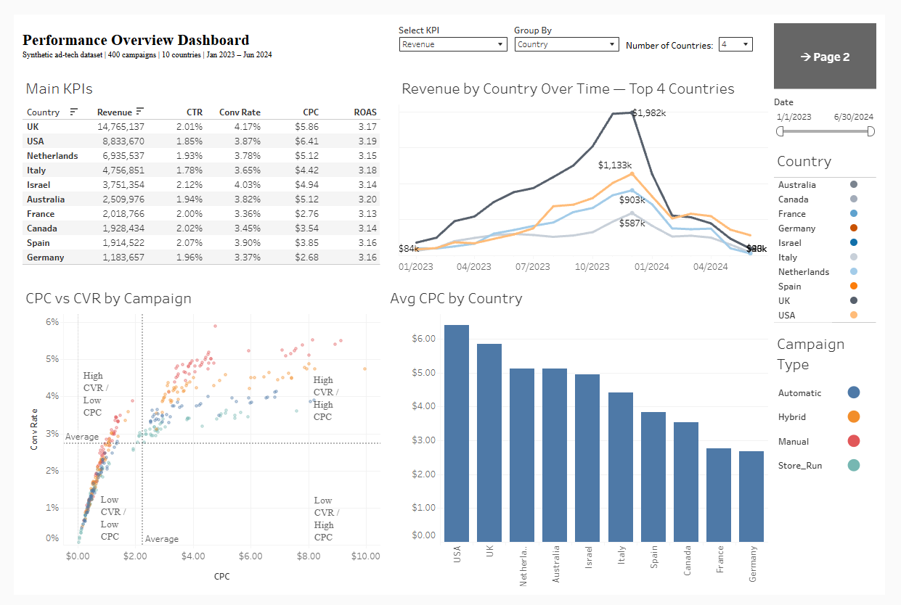
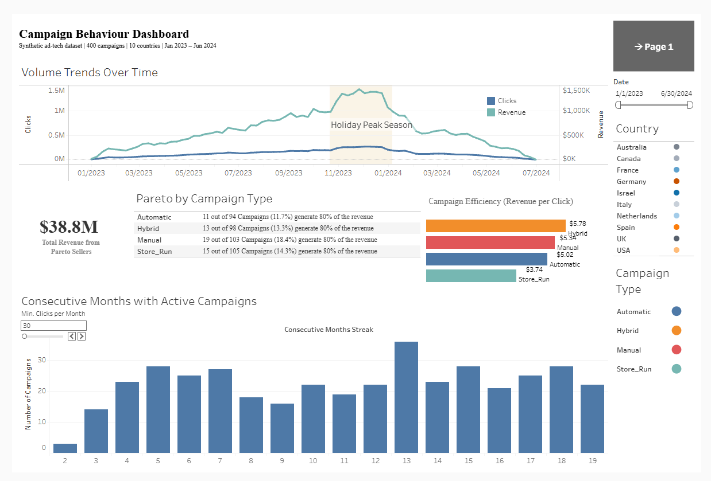
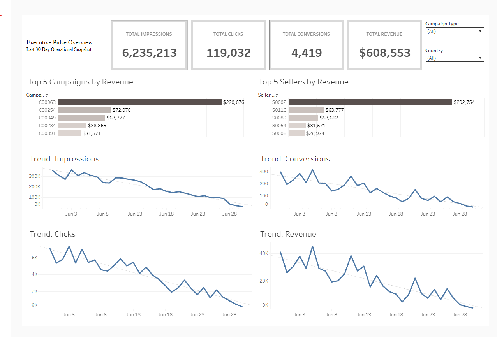

# Ad-Tech Campaign Dashboards — Tableau

Tableau dashboards built on a synthetic ad-tech retail dataset simulating
an online advertising platform with 400 campaigns, 115 sellers, and 10
countries across 18 months (Jan 2023 – Jun 2024).

---

## Dashboard 1 — Ad Campaign Performance Analysis

Two-page analytical dashboard covering campaign efficiency, KPI trends,
Pareto analysis, scatter plot quadrant analysis and campaign activity patterns.

**Pages:**
- **Performance Overview** — Dynamic KPI time series, KPI summary table,
  CPC vs CVR scatter with quadrant analysis, Avg CPC by country
- **Campaign Behaviour** — Volume trends with holiday annotation, Pareto
  analysis by campaign type, campaign efficiency, consecutive months activity

🔗 [View Live Dashboard on Tableau Public](https://public.tableau.com/app/profile/o.stra/viz/ad__campaigns/PerformanceOverviewDashboard?publish=yes)

---

## Dashboard 2 — Executive Pulse Overview

Single-page operational monitoring dashboard for a quick daily health
check of the platform. Shows raw volume metrics with trend lines, and top campaigns and sellers.

🔗 [View Live Dashboard on Tableau Public](https://public.tableau.com/app/profile/o.stra/viz/ad__campaigns2/ExecutivePulseOverview?publish=yes)

---

## Key Analytical Features

- Dynamic KPI parameter switching (Revenue, CTR, CVR, ROAS)
- Top N Countries parameter (user controlled)
- Group By parameter (Country vs Campaign Type)
- Pareto / 80-20 analysis by campaign type
- Trend lines
- Holiday peak season annotation
- Campaign activity streak analysis (consecutive active months)
- Quadrant analysis (CPC vs CVR) with reference lines

## Tools
Tableau Public · Calculated Fields · LOD Expressions ·
Table Calculations · Parameters · Dashboard Actions
